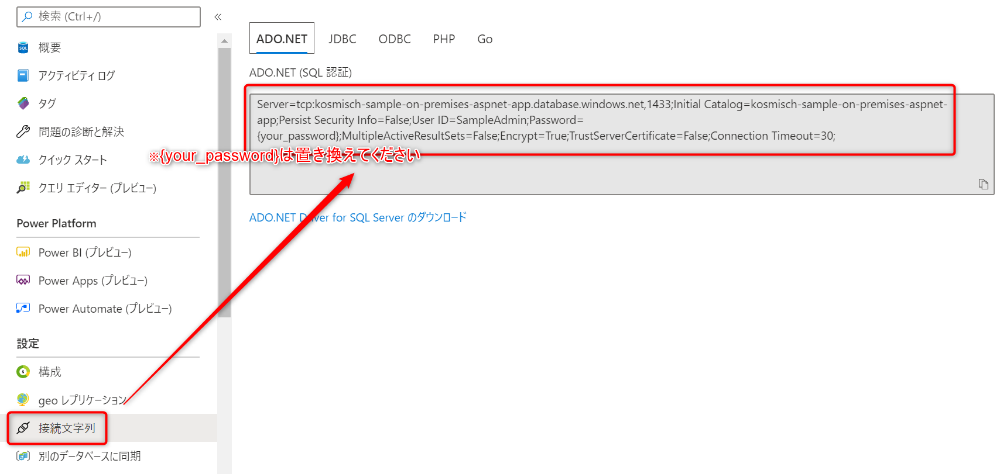
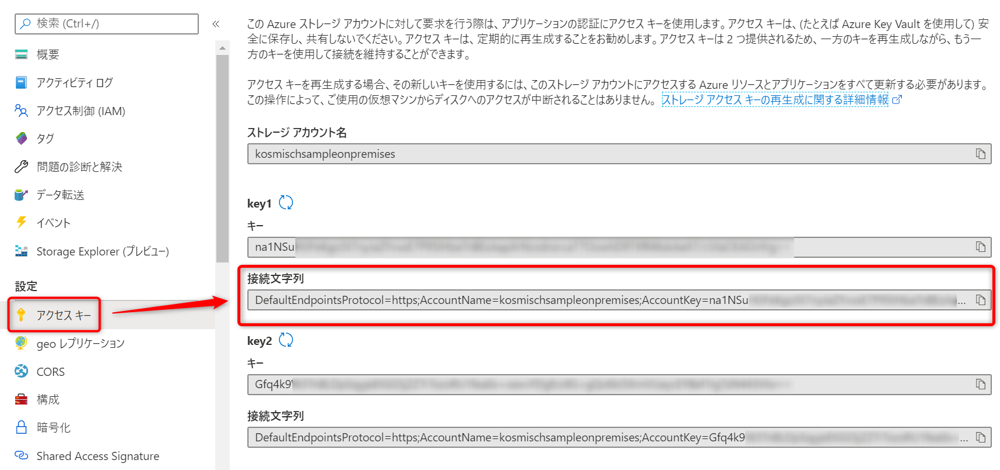
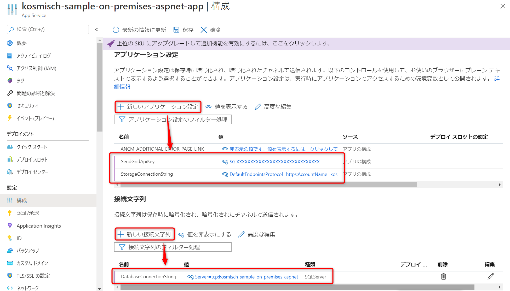

# ASP.NET Core アプリケーションを Microsoft Azure にデプロイする際の参考資料
## Azure SQL Database
### リソース作成に関するドキュメント
https://docs.microsoft.com/ja-jp/azure/azure-sql/database/single-database-create-quickstart?tabs=azure-portal

### 接続文字列の確認
リソース作成後、Azureポータルのリソース概要画面から以下のようにして接続文字列を確認します。  

## Azure Storage
### リソース作成に関するドキュメント
https://docs.microsoft.com/ja-jp/azure/storage/common/storage-account-create?tabs=azure-portal

### 接続文字列の確認
リソース作成後、Azureポータルのリソース概要画面から以下のようにして接続文字列を確認します。  

## SendGrid
### Azure上でのリソース作成・APIキー発行に関するドキュメント
https://docs.microsoft.com/ja-jp/azure/sendgrid-dotnet-how-to-send-email

## App Service
### リソース作成に関するドキュメント
https://docs.microsoft.com/ja-jp/azure/app-service/app-service-web-get-started-dotnet

### アプリケーション設定の追加
リソース作成後、Azureポータルのリソース概要から以下のようにしてアプリケーション設定を追加します。  

